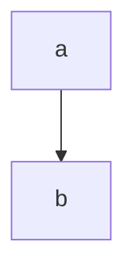
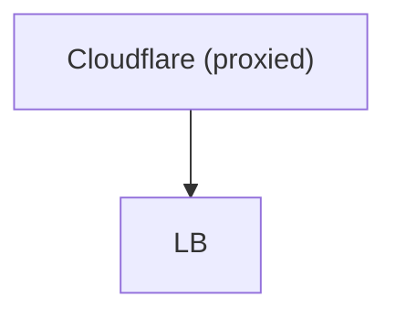
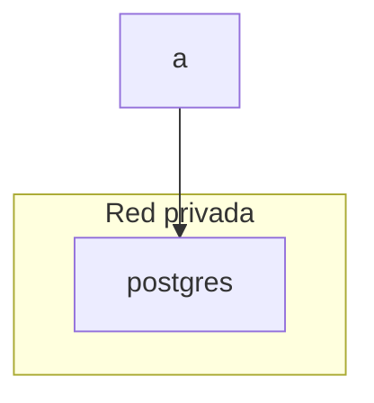
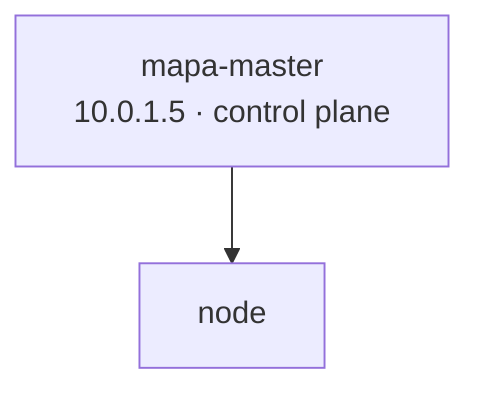
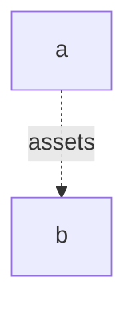

# Flowchart bisect — tell me which render

## F1 — minimal

## F2 — quoted labels + parens

## F3 — subgraph with quoted title

## F4 — subgraph plain title (no quotes/brackets)

## F5 — middle dot and br in label

## F6 — dotted link with label

