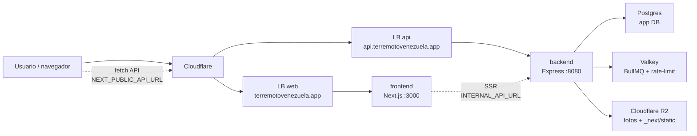

# Arquitectura actual

Estado de referencia: después del split `frontend/` + `backend/` de 2026-06-28.
Este documento describe cómo funciona el sistema hoy; propuestas futuras viven
en `docs/rfcs/` y decisiones aceptadas en `docs/adr/`.

## Resumen

El proyecto es un monorepo con dos servicios de aplicación y una capa de
infraestructura compartida:

- `frontend/`: Next.js 16 + React 19. Renderiza la UI, sirve assets y llama al
  backend por una URL absoluta (`NEXT_PUBLIC_API_URL`).
- `backend/`: Express 5 + TypeScript. Sirve toda la superficie `/api`, valida
  entorno al arrancar, accede a Postgres con Drizzle y comparte imagen con el
  worker y el Job de migraciones.
- `backend/worker/`: BullMQ sobre Valkey para sync, geocode, deduplicación,
  federación hub y backfills/migraciones.
- `infra/db/`: esquema Drizzle y migraciones SQL.
- `infra/k8s/` + `infra/tofu/`: despliegue en Hetzner Cloud con k3s,
  Postgres/Valkey privados, dos Load Balancers y workers efímeros.

## Flujo de requests

El frontend no accede directo a la base de datos. En cliente usa
`frontend/lib/api.ts`; en server components usa `frontend/lib/server-api.ts`.
Las fotos pueden venir como rutas relativas desde la API y se anclan al backend
con `mediaUrl()`.

## Frontend

- Next corre en modo `output: "standalone"` desde `frontend/`.
- `NEXT_PUBLIC_*` se inlinea en build; los cambios de esas variables requieren
  rebuild/redeploy del frontend.
- TanStack Query maneja cache, deduplicación y polling del cliente.
- Cloudflare Turnstile se monta con `useTurnstile()` en formularios públicos y
  entrega tokens de un solo uso al backend.
- `NEXT_PUBLIC_ASSET_PREFIX` puede apuntar a R2/CDN para `/_next/static` y evitar
  version-skew durante rolls multi-pod.

## Backend API

- Express monta los routers en `backend/src/routes/` y delega lógica a
  `backend/src/services/`.
- `backend/src/config/env.ts` valida entorno de forma fail-fast.
- La API escucha en `:8080` y expone `/api/readyz` para health/readiness.
- CORS usa allowlist (`CORS_ORIGINS`), porque el frontend y la API son dominios
  separados.
- Las mutaciones públicas combinan Zod, rate-limit y `requireHuman`
  (Cloudflare Turnstile). Las rutas admin usan `ADMIN_PASSWORD`/headers
  existentes.
- Lecturas polleadas usan cache en proceso y ETag cuando el contrato lo permite.
- APIs de terceros se consumen vía PROXY del backend (nunca desde el navegador),
  para controlar cache/contrato y no depender del CORS del tercero. Caso simple:
  `/api/geocode` proxea Nominatim (`services/geocode.ts`).
- **API keys (integraciones).** La superficie `api/public/*` se autentica con JWT
  (cookie/Bearer) O con una **API key** (`Authorization: Bearer mer_sk_…`). El
  middleware (`middleware/auth.ts`) detecta el prefijo, busca el hash SHA-256 en
  `api_keys` (índice único → O(1)), valida que no esté revocada/expirada y cuelga
  el mismo `req.user` que el JWT — así `requireCapability` no cambia. Las llaves
  son **self-service**: cualquier usuario invitado (capacidad `apikey:manage`,
  sembrada en todos los roles) crea/lista/revoca las suyas en el panel; el admin
  semilla puede revocar ajenas. Cada llave lleva **scopes** (subconjunto de
  capacidades): el permiso efectivo en cada request = `scopes ∩ capacidades vivas
  del usuario` — un techo least-privilege que aplica **incluso al admin semilla**
  (ver el corte en `auth/resolve.ts`). La llave cruda se muestra una sola vez; en
  DB solo va su hash + un prefijo no secreto. Revocar = soft-delete (`revokedAt`).

## Módulos de integración (DDD/hexagonal)

Las integraciones con terceros viven como **bounded contexts** en
`backend/src/modules/<dominio>/`, con capas separadas y dependencias hacia
adentro (la infraestructura depende del dominio, no al revés):

- `domain/`: entidades + value objects + reglas puras y el **puerto** (interfaz)
  que define la fuente. Sin HTTP, sin red, sin `env`.
- `application/`: casos de uso que orquestan el dominio sobre el puerto.
- `infrastructure/`: adaptadores que implementan el puerto (cliente HTTP, mapper
  anti-corruption) y decoradores transversales (p.ej. cache).
- `interface/http/`: router + controlador + presenter (única capa que conoce
  Express). El `@swagger` vive aquí; `lib/swagger.ts` ya escanea `modules/**`.
- `<dominio>-module.ts`: composition root; el único sitio que lee `env` y cablea
  adaptador → puerto → caso de uso → router.

Primer módulo: **acopio** (`modules/acopio/`), que proxea el directorio de
centros de acopio de ResponseGrid (config en `RESPONSEGRID_API_URL` /
`RESPONSEGRID_EMERGENCY_SLUG`). Añadir otra fuente = otro adaptador del mismo
puerto, cableado en el composition root; el dominio y la capa HTTP no cambian.
Las reglas ESLint de endpoints (`require-rate-limit`, guard de mutaciones)
también cubren `src/modules/**`.

## Datos y migraciones

- Postgres es la base de producción actual en el VPS privado de Hetzner.
- Neon queda como origen legado para backfills (`NEON_DATABASE_URL`), no como
  base viva de la app.
- Drizzle vive en `infra/db/schema.ts`; las migraciones versionadas viven en
  `infra/db/migrations/`.
- El Job `migrate` usa la imagen backend y corre antes del rollout. Si falla, la
  app no rota.
- Las migraciones deben ser expand-contract: pods viejos siguen sirviendo durante
  el rollout mientras los nuevos arrancan contra el esquema actualizado.
- **Réplica pública (hub SQL).** Un segundo Postgres (`mapa-hub-postgres`, tofu)
  recibe por **replicación lógica** solo las tablas/columnas publicables (sin PII
  directa de secretos/auditoría/federación; ver RFC 0006) y expone SQL crudo de
  **solo lectura** por TCP 5432 con TLS. El acceso lo emite el backend: un **super
  admin** (`mirror:manage`, gateada por `users.is_super_admin` con corte en
  `auth/resolve.ts`) crea un rol Postgres por consumidor y abre su IP en el
  firewall `mapa-hub-fw` vía la API de Hetzner. Si el hub cae, el primario no se
  afecta (`max_slot_wal_keep_size` acota el WAL). Runbook:
  `docs/deploy/replica-publica-hub.md`.

## Workers y colas

- Valkey respalda BullMQ y el rate-limit distribuido.
- `migrate-worker` usa la misma imagen backend con otro `command`.
- Los schedulers externos de sync/hub están desactivados en producción por
  configuración del Deployment (`SYNC_SCHEDULERS=0`, `HUB_SCHEDULERS=0`).
- El worker sigue disponible para jobs manuales como backfill de Neon,
  migración de fotos a R2 y trabajos encolados explícitamente.
- **Sismos USGS** (`earthquakes.queue.ts`): el worker poll-ea el feed realtime
  del USGS (`2.5_week.geojson`, global) cada `EARTHQUAKES_EVERY_MS` (default 60s,
  la cadencia con la que USGS lo refresca), filtra al bounding box de Venezuela y
  hace upsert por id de evento en la tabla `earthquakes`. Al arrancar, si la tabla
  está vacía, encola un backfill puntual vía FDSN query (últimos
  `EARTHQUAKES_BACKFILL_DAYS` días, una sola llamada — Venezuela genera <1
  sismo/día). A diferencia de sync/hub, este scheduler **siempre corre** (no va
  bajo `SYNC_SCHEDULERS`): es dato público y barato. El backfill de arranque es
  idempotente (solo si la tabla está vacía), así que **el primer deploy siembra
  solo** — sin Job ni paso manual. La superficie pública es `GET
  /api/earthquakes` (read-only, anónima, cacheada con ETag).

## Despliegue

- El despliegue canónico es Hetzner Cloud + k3s + Cloudflare.
- El workflow `.github/workflows/deploy-hetzner.yml` es deploy-only:
  PR mergeado a `main` despliega staging; prod requiere `workflow_dispatch`.
- CI construye dos imágenes: `*-frontend:<sha>` y `*-backend:<sha>`.
- Kubernetes corre dos Deployments principales: `web` (frontend) y `api`
  (backend), cada uno con su Service LoadBalancer y HPA.
- El worker y el Job de migraciones reutilizan la imagen backend.
- R2 sirve fotos y, cuando se configura `NEXT_PUBLIC_ASSET_PREFIX`, assets
  estáticos de Next.

Para detalles operativos del clúster, ver
`docs/architecture/despliegue-kubernetes.md` y `docs/deploy/`.

## Al cambiar arquitectura

Cada cambio que modifique esta forma del sistema debe actualizar:

- `docs/architecture/architecture.md` para reflejar el estado nuevo.
- `docs/architecture/despliegue-kubernetes.md` si toca k8s, OpenTofu, workflow,
  DNS/TLS, GHCR, Cloudflare o R2.
- `AGENTS.md` cuando cambien reglas que los agentes deben seguir. `CLAUDE.md`
  apunta a `AGENTS.md`, así que no dupliques instrucciones.
- `.env.example` e `infra/k8s/secret.example.yaml` si cambia el contrato de
  entorno.
- `docs/README.md` si agregas, renombras o mueves documentos.
