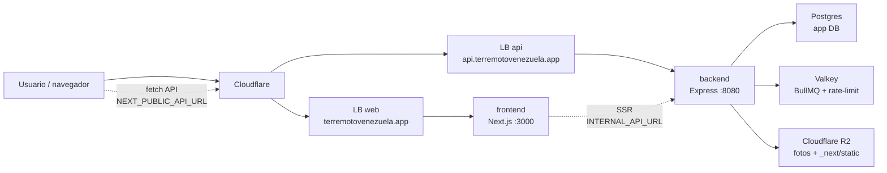

# Arquitectura actual

Estado de referencia: después del split `frontend/` + `backend/` de 2026-06-28.
Este documento describe cómo funciona el sistema hoy; propuestas futuras viven
en `docs/rfcs/` y decisiones aceptadas en `docs/adr/`.

## Resumen

El proyecto es un monorepo con dos servicios de aplicación y una capa de
infraestructura compartida:

- `frontend/`: Next.js 16 + React 19. Renderiza la UI, sirve assets y llama al
  backend por una URL absoluta (`NEXT_PUBLIC_API_URL`).
- `backend/`: Express 5 + TypeScript. Sirve toda la superficie `/api`, valida
  entorno al arrancar, accede a Postgres con Drizzle y comparte imagen con el
  worker y el Job de migraciones.
- `backend/worker/`: BullMQ sobre Valkey para sync, geocode, deduplicación,
  federación hub y backfills/migraciones.
- `infra/db/`: esquema Drizzle y migraciones SQL.
- `infra/k8s/` + `infra/tofu/`: despliegue en Hetzner Cloud con k3s,
  Postgres/Valkey privados, dos Load Balancers y workers efímeros.

## Flujo de requests

El frontend no accede directo a la base de datos. En cliente usa
`frontend/lib/api.ts`; en server components usa `frontend/lib/server-api.ts`.
Las fotos pueden venir como rutas relativas desde la API y se anclan al backend
con `mediaUrl()`.

## Frontend

- Next corre en modo `output: "standalone"` desde `frontend/`.
- `NEXT_PUBLIC_*` se inlinea en build; los cambios de esas variables requieren
  rebuild/redeploy del frontend.
- TanStack Query maneja cache, deduplicación y polling del cliente.
- Cloudflare Turnstile se monta con `useTurnstile()` en formularios públicos y
  entrega tokens de un solo uso al backend.
- `NEXT_PUBLIC_ASSET_PREFIX` puede apuntar a R2/CDN para `/_next/static` y evitar
  version-skew durante rolls multi-pod.

## Backend API

- Express monta los routers en `backend/src/routes/` y delega lógica a
  `backend/src/services/`.
- `backend/src/config/env.ts` valida entorno de forma fail-fast.
- La API escucha en `:8080` y expone `/api/readyz` para health/readiness.
- CORS usa allowlist (`CORS_ORIGINS`), porque el frontend y la API son dominios
  separados.
- Las mutaciones públicas combinan Zod, rate-limit y `requireHuman`
  (Cloudflare Turnstile). Las rutas admin usan `ADMIN_PASSWORD`/headers
  existentes.
- Lecturas polleadas usan cache en proceso y ETag cuando el contrato lo permite.

## Datos y migraciones

- Postgres es la base de producción actual en el VPS privado de Hetzner.
- Neon queda como origen legado para backfills (`NEON_DATABASE_URL`), no como
  base viva de la app.
- Drizzle vive en `infra/db/schema.ts`; las migraciones versionadas viven en
  `infra/db/migrations/`.
- El Job `migrate` usa la imagen backend y corre antes del rollout. Si falla, la
  app no rota.
- Las migraciones deben ser expand-contract: pods viejos siguen sirviendo durante
  el rollout mientras los nuevos arrancan contra el esquema actualizado.

## Workers y colas

- Valkey respalda BullMQ y el rate-limit distribuido.
- `migrate-worker` usa la misma imagen backend con otro `command`.
- Los schedulers externos de sync/hub están desactivados en producción por
  configuración del Deployment (`SYNC_SCHEDULERS=0`, `HUB_SCHEDULERS=0`).
- El worker sigue disponible para jobs manuales como backfill de Neon,
  migración de fotos a R2 y trabajos encolados explícitamente.
- La cola `patient-imports` procesa la importación autenticada de pacientes
  hospitalarios (#151): la API `POST /api/public/patient-imports` (capacidad
  `patient:import`) guarda el lote en staging (`patient_imports` +
  `patient_import_rows`) y encola; el worker normaliza, valida y deduplica las
  filas, y `POST .../{id}/apply` encola la escritura idempotente en
  `hospital_patients` (solo filas válidas y únicas). El dato crudo y los campos
  sensibles (documento, notas, contacto) viven en staging restringido y no se
  exponen en las respuestas. OCR/ICR queda como metadato a futuro, sin proveedor.

## Despliegue

- El despliegue canónico es Hetzner Cloud + k3s + Cloudflare.
- El workflow `.github/workflows/deploy-hetzner.yml` es deploy-only:
  PR mergeado a `main` despliega staging; prod requiere `workflow_dispatch`.
- CI construye dos imágenes: `*-frontend:<sha>` y `*-backend:<sha>`.
- Kubernetes corre dos Deployments principales: `web` (frontend) y `api`
  (backend), cada uno con su Service LoadBalancer y HPA.
- El worker y el Job de migraciones reutilizan la imagen backend.
- R2 sirve fotos y, cuando se configura `NEXT_PUBLIC_ASSET_PREFIX`, assets
  estáticos de Next.

Para detalles operativos del clúster, ver
`docs/architecture/despliegue-kubernetes.md` y `docs/deploy/`.

## Al cambiar arquitectura

Cada cambio que modifique esta forma del sistema debe actualizar:

- `docs/architecture/architecture.md` para reflejar el estado nuevo.
- `docs/architecture/despliegue-kubernetes.md` si toca k8s, OpenTofu, workflow,
  DNS/TLS, GHCR, Cloudflare o R2.
- `AGENTS.md` cuando cambien reglas que los agentes deben seguir. `CLAUDE.md`
  apunta a `AGENTS.md`, así que no dupliques instrucciones.
- `.env.example` e `infra/k8s/secret.example.yaml` si cambia el contrato de
  entorno.
- `docs/README.md` si agregas, renombras o mueves documentos.
