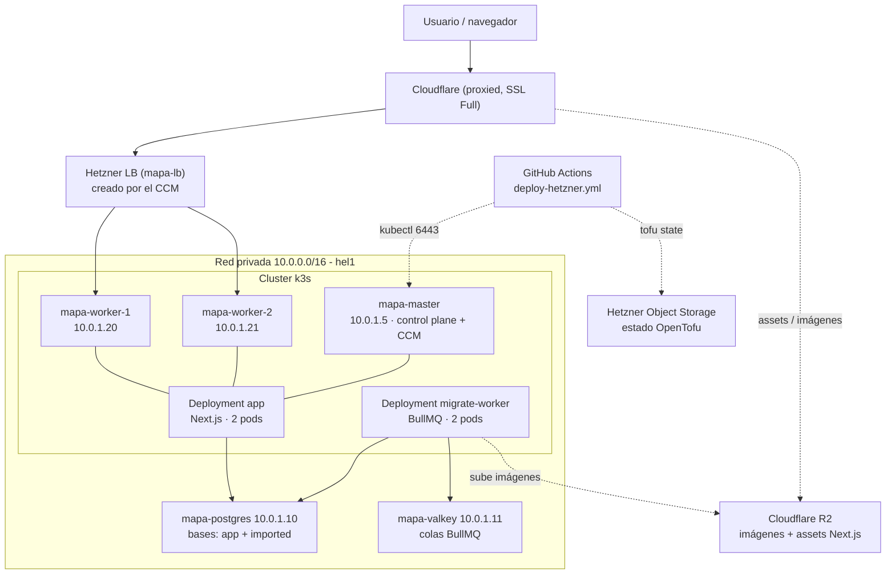

# Arquitectura del despliegue (Hetzner + k3s + OpenTofu)

Cómo está desplegada **hoy** la app: infraestructura en Hetzner Cloud
provisionada con **OpenTofu**, un clúster **k3s** que corre la app y los
workers, y **Cloudflare** (R2 + CDN + TLS) por delante.

> Fuente de verdad de la infra: [`infra/tofu/`](../../infra/tofu/) (servidores,
> red, firewall) y [`infra/k8s/`](../../infra/k8s/) (manifiestos del clúster).
> El pipeline que lo aplica: `.github/workflows/deploy-hetzner.yml`.

## Resumen

- **Provisión:** OpenTofu (provider `hcloud`), estado remoto en Hetzner Object
  Storage (bucket `terremoto-vzla-bucket`, hel1) — NO en R2.
- **Cómputo:** k3s — 1 master + 2 workers fijos (cx23, Debian 12, hel1).
- **Estado (PETs):** Postgres y Valkey en VPS dedicados, nunca recreados.
- **Red:** privada `10.0.0.0/16` (subnet `10.0.1.0/24`); IPs privadas fijas.
- **Ingreso:** Hetzner Load Balancer (creado por el CCM) → NodePort → pods.
- **Borde:** Cloudflare proxied (naranja), SSL "Full", + R2 para imágenes y
  assets estáticos de Next.js.

## OpenTofu — infraestructura

Archivos en [`infra/tofu/`](../../infra/tofu/):

| Archivo | Qué crea |
| --- | --- |
| `network.tf` | Red privada `mapa-net` (`10.0.0.0/16`) + subnet `10.0.1.0/24` |
| `k3s-master.tf` | Servidor `mapa-master` (control plane, `10.0.1.5`) |
| `k3s-workers.tf` | `mapa-worker-1/2` (`10.0.1.20`, `.21`); base mínima de 2 |
| `postgres.tf` | VPS `mapa-postgres` (`10.0.1.10`) + volumen `mapa-pgdata` |
| `valkey.tf` | VPS `mapa-valkey` (`10.0.1.11`) |
| `firewall.tf` | Firewall público: solo `22` (SSH) y `6443` (API k3s para CI) |
| `backend.tf` | Estado remoto S3 en Hetzner Object Storage |
| `variables.tf` / `outputs.tf` | Entradas (tokens, IPs, tamaños) y URLs de salida |
| `cloud-init/*.tftpl` | Bootstrap de cada servidor (k3s, Postgres, Valkey) |

Puntos clave:

- **IPs privadas fijas** (`variables.tf`) → `DATABASE_URL`, `VALKEY_URL` y la
  dirección del master son estables y predecibles.
- **PETs protegidas:** Postgres y Valkey tienen `prevent_destroy = true` y
  `ignore_changes = [user_data]` (cloud-init corre solo en el primer boot).
- **Firewall:** los puertos `5432`/`6379` NO se abren — el firewall de Hetzner
  solo filtra tráfico **público**; el tráfico de la red privada lo evita por
  completo. El acceso a la BD se cierra además con `pg_hba.conf`
  (`mapa_app` solo desde `10.0.0.0/16`, scram-sha-256).
- **Dos bases en el mismo Postgres:** `app` (interna, datos de la app — aquí
  viven los datos migrados de Neon) e `imported` (reservada para sync/export).

## k3s — clúster

Master configurado para Hetzner (`cloud-init/k3s-master.yaml.tftpl`):

- `--disable-cloud-controller` + `cloud-provider=external` → el **Hetzner CCM**
  gestiona IPs de nodos y los `Service` tipo LoadBalancer.
- `--disable traefik servicelb` → usamos el LB de Hetzner, no los de k3s.
- `--flannel-iface enp7s0` / `node-ip` → el tráfico del clúster va por la red
  privada (pod CIDR `10.42.0.0/16`).
- **CCM como Deployment crudo** (no HelmChart): `cloud-provider=external` deja
  cada nodo con el taint `uninitialized:NoSchedule` hasta que el CCM lo limpia,
  pero el Job de helm-install no tolera ese taint → deadlock (k3s#1807). El
  `ccm-networks.yaml` oficial ya tolera el taint + usa `hostNetwork`, así que se
  despliega crudo vía auto-deploy manifests. `allocate-node-cidrs=false` (flannel
  ya hace el pod-networking).
- **tls-san:** el IP público del master se agrega como SAN en el boot (drop-in
  `config.yaml.d/tls-san.yaml`, leído del metadata de Hetzner) para que el runner
  de CI valide el cert de la API al conectar por el IP público.

### Cargas en el clúster (`infra/k8s/`)

| Manifiesto | Qué es |
| --- | --- |
| `service.yaml` | Namespace `mapa` + `Service` LoadBalancer (TEMPLATE; TLS/puertos los inyecta el workflow con envsubst) |
| `deployment.yaml` | App Next.js (UI + API). 2 réplicas, rolling `maxUnavailable:0` |
| `worker-deployment.yaml` | Workers BullMQ de migración. 2 réplicas, sin Service |
| `migrate-enqueue-job.yaml` | Job productor que encola la migración |

- **App** (`deployment.yaml`): "cattle" — pods inmutables, reemplazados en cada
  deploy. Cero-downtime por `maxUnavailable:0`/`maxSurge:1` + `readinessProbe`
  `/api/readyz` (chequea la BD) + drenado con `terminationGracePeriodSeconds`.
  CI parcha el tag de imagen por SHA.
- **Workers** (`worker-deployment.yaml`): no están detrás del LB (tiran trabajo
  de Valkey). SIGTERM drena los jobs en vuelo (120s de gracia).
- **Service LoadBalancer:** el CCM crea un Hetzner LB real (`mapa-lb`) apuntando
  a los pods por la red privada. Health check sobre el **NodePort** (no fijar
  `health-check-port`; `3000` es el puerto interno del pod → causaría 503),
  protocolo HTTP, path `/api/readyz`.

## Borde: Cloudflare + R2

- **TLS staging:** termina en **Cloudflare** (A-record proxied/naranja, SSL mode
  "Full"); el LB habla HTTP `:80`. (Prod futuro: TLS en el LB con cert gestionado
  + DNS en Vercel.)
- **R2 (Cloudflare):** bucket `vzla-terremoto-bucket` con dominio CDN propio.
  Sirve (1) las **imágenes** (subidas vía `lib/r2.ts` en cada ingesta + el
  backlog migrado por `worker/`) y (2) los **assets estáticos** de Next.js
  (`assetPrefix` → R2), evitando el version-skew entre pods.

## Pipeline (`deploy-hetzner.yml`)

Un workflow con input `what`: `plan` / `deploy` / `plan-infra` / `provision` /
`recreate-master` / `migrate`, y `target` (`staging` / `prod`). Construye la
imagen (app y worker), la sube a GHCR, renderiza el `Service` por entorno
(envsubst), aplica los manifiestos y hace el rollout. El estado de OpenTofu vive
en el bucket de Hetzner (el runner es efímero).

## Diagrama

