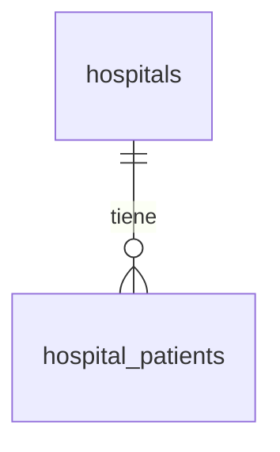
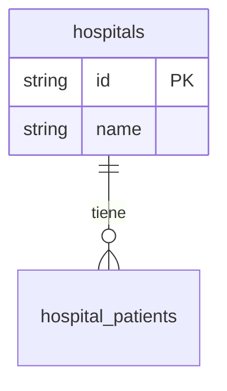

# Mermaid viewer test — tell me which render

## A — flowchart (simplest possible, control)

```mermaid
flowchart LR
    A --> B
```

## B — erDiagram, ONE relation, no attributes

```mermaid
erDiagram
    hospitals ||--o{ hospital_patients : tiene
```

## C — erDiagram with one attribute block

```mermaid
erDiagram
    hospitals ||--o{ hospital_patients : tiene
    hospitals {
        string id PK
        string name
    }
```
