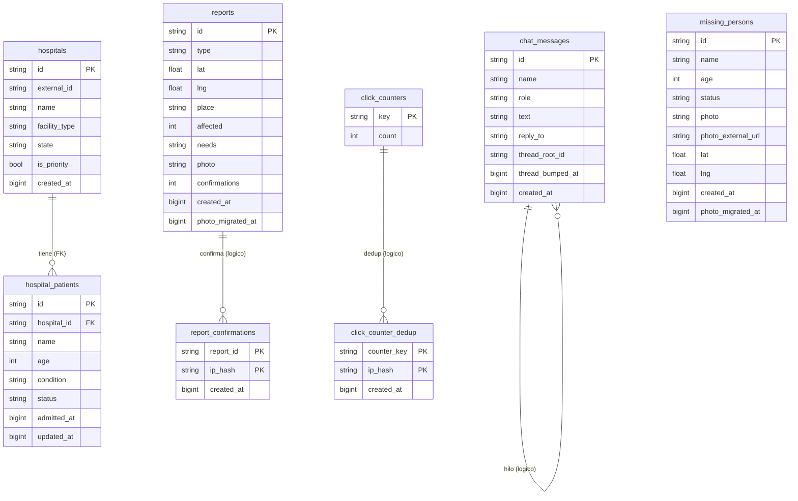

# Modelo de datos

Esquema de la base de datos (Neon Postgres / Hetzner `app`) del proyecto
**Mapa de Emergencia y Rescate**.

> **Fuente de verdad:** [`infra/db/schema.ts`](../../infra/db/schema.ts) (Drizzle)
> define las **16 tablas** que existen en prod: 12 canónicas activas +
> `contact_messages` (su DDL viva está en `lib/contact-inbox.ts`) +
> `analytics_events`, `damage_candidates`, `unidentified_persons` (legado/externas
> sin código de app, pero presentes en la base). Si cambias el esquema, edita
> `schema.ts` y luego actualiza este doc.

## Convenciones

Tomadas del código (ver cabecera de `schema.ts`):

- **IDs de texto:** `id TEXT PRIMARY KEY`, generados por la app con
  `crypto.randomUUID()`. Excepción: `sync_runs.id` es `BIGSERIAL`.
- **Marcas de tiempo:** epoch en **milisegundos** guardado como `BIGINT`
  (modo `number`; valores dentro de `Number.MAX_SAFE_INTEGER`).
- **Coordenadas:** `DOUBLE PRECISION` (`lat` / `lng`).
- **`photo_migrated_at`:** marca cuándo la foto se movió a R2. `NULL` = pendiente
  (lo usa el worker de re-hospedaje para reclamar solo filas sin migrar).

## Resumen de tablas

| Tabla | Grupo | PK | Propósito |
| --- | --- | --- | --- |
| `reports` | canónica | `id` | Reportes de emergencia en el mapa |
| `report_confirmations` | canónica | `(report_id, ip_hash)` | Dedup de confirmaciones por IP |
| `missing_persons` | canónica | `id` | Personas desaparecidas / localizadas |
| `chat_messages` | canónica | `id` | Chat ciudadano (con hilos) |
| `hospitals` | canónica | `id` | Hospitales y centros de atención |
| `hospital_patients` | canónica | `id` | Pacientes por hospital (**FK** → hospitals) |
| `donations` | canónica | `id` | Donaciones registradas |
| `click_counters` | canónica | `key` | Contadores de clics agregados |
| `click_counter_dedup` | canónica | `(counter_key, ip_hash)` | Dedup de clics por IP |
| `geocode_cache` | canónica | `normalized_key` | Caché de geocodificación |
| `sync_state` | canónica | `source` | Estado de paginación de cada sync |
| `sync_runs` | canónica | `id` | Bitácora de ejecuciones de sync |
| `contact_messages` | runtime-DDL | `id` | Bandeja de contacto (DDL en `lib/contact-inbox.ts`) |
| `analytics_events` | legado/externa | `id` | Eventos de analítica (sin código de app) |
| `damage_candidates` | legado/externa | `id` | Candidatos de daño estructural (sin código) |
| `unidentified_persons` | legado/externa | `id` | Personas no identificadas (sin código) |

---

## Tablas canónicas (`infra/db/schema.ts`)

### `reports`

Reportes de emergencia que se muestran en el mapa.

| Columna | Tipo | Nulo | Default | Notas |
| --- | --- | --- | --- | --- |
| `id` | TEXT | no | — | PK |
| `type` | TEXT | no | — | Tipo de marcador |
| `lat` | DOUBLE PRECISION | no | — | |
| `lng` | DOUBLE PRECISION | no | — | |
| `place` | TEXT | no | — | Nombre/dirección |
| `affected` | INTEGER | no | `0` | Personas afectadas |
| `needs` | TEXT | no | `''` | |
| `photo` | TEXT | sí | — | base64 o URL del CDN tras migrar |
| `confirmations` | INTEGER | no | `0` | |
| `created_at` | BIGINT | no | — | epoch-ms |
| `photo_migrated_at` | BIGINT | sí | — | `NULL` = foto sin migrar a R2 |

Índices: `idx_reports_created_at (created_at DESC)`;
`idx_reports_photo_pending (id) WHERE photo_migrated_at IS NULL AND photo IS NOT NULL`.

### `report_confirmations`

Dedup de confirmaciones de un reporte por IP (append-only).

| Columna | Tipo | Nulo | Default | Notas |
| --- | --- | --- | --- | --- |
| `report_id` | TEXT | no | — | PK compuesta · *lógico* → `reports.id` |
| `ip_hash` | TEXT | no | — | PK compuesta |
| `created_at` | BIGINT | no | — | epoch-ms |

PK: `(report_id, ip_hash)`.

### `missing_persons`

Personas desaparecidas y localizadas (incluye registros importados por sync).

| Columna | Tipo | Nulo | Default | Notas |
| --- | --- | --- | --- | --- |
| `id` | TEXT | no | — | PK |
| `name` | TEXT | no | — | |
| `age` | INTEGER | sí | — | |
| `description` | TEXT | no | `''` | |
| `last_seen` | TEXT | no | `''` | |
| `contact` | TEXT | no | `''` | |
| `photo` | TEXT | sí | — | base64 o URL del CDN tras migrar |
| `status` | TEXT | no | `'active'` | `active` / `found` |
| `resolution_note` | TEXT | sí | — | |
| `resolution_photo` | TEXT | sí | — | Foto-prueba al localizar |
| `resolved_at` | BIGINT | sí | — | epoch-ms |
| `external_id` | TEXT | sí | — | ID en la fuente externa |
| `source` | TEXT | sí | — | Fuente del registro |
| `source_url` | TEXT | sí | — | |
| `photo_external_url` | TEXT | sí | — | Foto alojada externamente |
| `lat` | DOUBLE PRECISION | sí | — | |
| `lng` | DOUBLE PRECISION | sí | — | |
| `created_at` | BIGINT | no | — | epoch-ms |
| `photo_migrated_at` | BIGINT | sí | — | cubre `photo` y `photo_external_url` |

Índices: `idx_missing_status_created (status, created_at DESC)`;
`idx_missing_map_coords (lat, lng)`;
`idx_missing_photo_pending (id) WHERE photo_migrated_at IS NULL AND (photo IS NOT NULL OR photo_external_url IS NOT NULL)`.

### `chat_messages`

Chat ciudadano con soporte de respuestas e hilos (auto-referencia lógica).

| Columna | Tipo | Nulo | Default | Notas |
| --- | --- | --- | --- | --- |
| `id` | TEXT | no | — | PK |
| `name` | TEXT | no | `'Anónimo'` | |
| `role` | TEXT | no | `'ciudadano'` | |
| `text` | TEXT | no | — | |
| `reply_to` | TEXT | sí | — | *lógico* → `chat_messages.id` |
| `reply_preview` | TEXT | sí | — | |
| `thread_root_id` | TEXT | sí | — | *lógico* → `chat_messages.id` |
| `thread_bumped_at` | BIGINT | sí | — | epoch-ms |
| `created_at` | BIGINT | no | — | epoch-ms |

Índices: `idx_chat_thread_bumped (thread_bumped_at DESC)`;
`idx_chat_reply (reply_to)`.

> Prod conserva 3 columnas legado en desuso (`reply_to_id`, `reply_to_name`,
> `reply_to_text`), sustituidas por `reply_to` / `reply_preview`. Se omiten del
> esquema Drizzle a propósito.

### `hospitals`

Hospitales y centros de atención.

| Columna | Tipo | Nulo | Default | Notas |
| --- | --- | --- | --- | --- |
| `id` | TEXT | no | — | PK |
| `external_id` | TEXT | sí | — | único WHERE NOT NULL |
| `name` | TEXT | no | — | |
| `facility_type` | TEXT | no | `'hospital'` | |
| `state` | TEXT | no | `''` | |
| `municipality` | TEXT | no | `''` | |
| `address` | TEXT | no | `''` | |
| `level` | TEXT | sí | — | |
| `priority_zone` | TEXT | no | `'P3'` | |
| `is_priority` | BOOLEAN | no | `false` | |
| `created_at` | BIGINT | no | — | epoch-ms |

Índices: `idx_hospitals_external (external_id) UNIQUE WHERE external_id IS NOT NULL`;
`idx_hospitals_state (state, priority_zone, name)`.

### `hospital_patients`

Pacientes asociados a un hospital. **Única FK real del esquema.**

| Columna | Tipo | Nulo | Default | Notas |
| --- | --- | --- | --- | --- |
| `id` | TEXT | no | — | PK |
| `hospital_id` | TEXT | no | — | **FK** → `hospitals.id` `ON DELETE CASCADE` |
| `name` | TEXT | no | — | |
| `age` | INTEGER | sí | — | |
| `condition` | TEXT | no | `'unknown'` | |
| `status` | TEXT | no | `'hospitalized'` | |
| `notes` | TEXT | no | `''` | |
| `contact` | TEXT | no | `''` | |
| `admitted_at` | BIGINT | no | — | epoch-ms |
| `updated_at` | BIGINT | no | — | epoch-ms |

Índices: `idx_hospital_patients_hospital (hospital_id, status, admitted_at DESC)`.

### `donations`

Donaciones registradas (append-only en la práctica; ver `worker/tables.ts`).

| Columna | Tipo | Nulo | Default | Notas |
| --- | --- | --- | --- | --- |
| `id` | TEXT | no | — | PK |
| `name` | TEXT | no | — | |
| `amount_usd` | INTEGER | no | — | en centavos |
| `ip_hash` | TEXT | sí | — | |
| `user_agent` | TEXT | sí | — | |
| `created_at` | BIGINT | no | — | epoch-ms |
| `status` | TEXT | no | `'intent'` | ciclo de vida; el código no lo muta hoy |

Índices: `donations_created_at_idx (created_at DESC)`.

> Nota: `status` existe en prod y ya está en el esquema Drizzle. Hoy el código
> nunca lo actualiza (insert-only), por eso `worker/tables.ts` la migra como
> append-only (`ignore`). Si se agrega un flujo que mute `status`, cambia su
> política de migración a `update`.

### `click_counters`

Contadores de clics agregados.

| Columna | Tipo | Nulo | Default | Notas |
| --- | --- | --- | --- | --- |
| `key` | TEXT | no | — | PK |
| `count` | INTEGER | no | `0` | |

### `click_counter_dedup`

Dedup de clics por IP (append-only).

| Columna | Tipo | Nulo | Default | Notas |
| --- | --- | --- | --- | --- |
| `counter_key` | TEXT | no | — | PK compuesta · *lógico* → `click_counters.key` |
| `ip_hash` | TEXT | no | — | PK compuesta |
| `created_at` | BIGINT | no | — | epoch-ms |

PK: `(counter_key, ip_hash)`.

### `geocode_cache`

Caché de geocodificación de lugares.

| Columna | Tipo | Nulo | Default | Notas |
| --- | --- | --- | --- | --- |
| `normalized_key` | TEXT | no | — | PK |
| `lat` | DOUBLE PRECISION | no | — | |
| `lng` | DOUBLE PRECISION | no | — | |
| `label` | TEXT | no | `''` | |
| `updated_at` | BIGINT | no | — | epoch-ms |

### `sync_state`

Estado de paginación por fuente de sincronización.

| Columna | Tipo | Nulo | Default | Notas |
| --- | --- | --- | --- | --- |
| `source` | TEXT | no | — | PK |
| `next_page` | INTEGER | no | `1` | |
| `total_pages` | INTEGER | sí | — | |
| `last_run_at` | BIGINT | sí | — | epoch-ms |
| `last_cycle_completed_at` | BIGINT | sí | — | epoch-ms |
| `updated_at` | BIGINT | no | — | epoch-ms |

### `sync_runs`

Bitácora de ejecuciones de sync (append-only).

| Columna | Tipo | Nulo | Default | Notas |
| --- | --- | --- | --- | --- |
| `id` | BIGSERIAL | no | seq | PK |
| `source` | TEXT | no | — | |
| `trigger` | TEXT | sí | — | |
| `ok` | BOOLEAN | no | — | |
| `fetched` | INTEGER | no | `0` | |
| `inserted` | INTEGER | no | `0` | |
| `updated` | INTEGER | no | `0` | |
| `skipped` | INTEGER | no | `0` | |
| `errors` | INTEGER | no | `0` | |
| `from_page` | INTEGER | sí | — | |
| `to_page` | INTEGER | sí | — | |
| `next_page` | INTEGER | sí | — | |
| `cycle_completed` | BOOLEAN | sí | — | |
| `error` | TEXT | sí | — | |
| `duration_ms` | INTEGER | no | `0` | |
| `started_at` | BIGINT | no | — | epoch-ms |
| `finished_at` | BIGINT | no | — | epoch-ms |

Índices: `idx_sync_runs_started (started_at DESC)`.

---

## Tablas adicionales (legado / DDL en runtime)

> Estas tablas ya están en `infra/db/schema.ts`, pero conviene resaltar su
> origen: `contact_messages` tiene su DDL viva en `lib/contact-inbox.ts`; las
> otras 3 son legado/externas sin código de app (presentes solo porque existen
> en prod y la migración las copia).

### `contact_messages` — DDL en runtime

Definida con `CREATE TABLE IF NOT EXISTS` en
[`lib/contact-inbox.ts`](../../lib/contact-inbox.ts) (bandeja de contacto del
panel admin). Candidata a moverse al esquema Drizzle.

| Columna | Tipo | Nulo | Default | Notas |
| --- | --- | --- | --- | --- |
| `id` | TEXT | no | — | PK |
| `name` | TEXT | no | — | |
| `email` | TEXT | no | — | |
| `subject` | TEXT | no | — | |
| `message` | TEXT | no | — | |
| `read` | BOOLEAN | no | `false` | |
| `ip_hash` | TEXT | sí | — | |
| `created_at` | BIGINT | no | — | epoch-ms |

Índices: `contact_messages_created_at_idx (created_at DESC)`;
`contact_messages_unread_idx (read, created_at DESC)`.

### `analytics_events` — legado/externa (sin código de app)

Presente en la fuente Neon y copiada por la migración; sin referencias en el
código de la app. Definición tomada de la base.

| Columna | Tipo | Nulo | Notas |
| --- | --- | --- | --- |
| `id` | TEXT | no | PK |
| `session_id` | TEXT | no | |
| `type` | TEXT | no | |
| `path` | TEXT | no | |
| `label` | TEXT | no | |
| `referrer` | TEXT | no | |
| `user_agent` | TEXT | no | |
| `screen` | TEXT | no | |
| `language` | TEXT | no | |
| `metadata` | JSONB | no | |
| `created_at` | BIGINT | no | epoch-ms |

### `damage_candidates` — legado/externa (sin código de app)

| Columna | Tipo | Nulo | Notas |
| --- | --- | --- | --- |
| `id` | TEXT | no | PK |
| `building_id` | TEXT | no | |
| `name` | TEXT | no | |
| `lat` | DOUBLE PRECISION | no | |
| `lng` | DOUBLE PRECISION | no | |
| `damage_level` | TEXT | no | |
| `confidence` | DOUBLE PRECISION | no | |
| `review_status` | TEXT | no | |
| `source_before` | TEXT | no | |
| `source_after` | TEXT | no | |
| `source_url` | TEXT | no | |
| `notes` | TEXT | no | |
| `created_at` | BIGINT | no | epoch-ms |
| `updated_at` | BIGINT | no | epoch-ms |

### `unidentified_persons` — legado/externa (sin código de app)

| Columna | Tipo | Nulo | Notas |
| --- | --- | --- | --- |
| `id` | TEXT | no | PK |
| `status` | TEXT | no | |
| `name` | TEXT | no | |
| `surname` | TEXT | no | |
| `location_found` | TEXT | no | |
| `description` | TEXT | no | |
| `contact_name` | TEXT | no | |
| `contact_phone` | TEXT | no | |
| `photo` | TEXT | sí | |
| `created_at` | BIGINT | no | epoch-ms |

---

## Relaciones

- **FK real (única):** `hospital_patients.hospital_id` → `hospitals.id`
  (`ON DELETE CASCADE`).
- **Relaciones lógicas (no forzadas por FK):**
  - `report_confirmations.report_id` → `reports.id`
  - `click_counter_dedup.counter_key` → `click_counters.key`
  - `chat_messages.reply_to` / `thread_root_id` → `chat_messages.id` (auto-ref)
  - `sync_state.source` / `sync_runs.source` comparten el espacio de "fuentes",
    sin clave foránea entre sí.

El resto de las tablas son independientes (sin relaciones).

### Diagrama (Mermaid)

> `(FK)` = clave foránea real; `(logico)` = relación lógica no forzada por la
> base de datos. Mermaid `erDiagram` solo dibuja líneas sólidas; la distinción
> va en la etiqueta.

> El diagrama muestra solo las tablas **con relaciones**. Las demás
> (`donations`, `geocode_cache`, `sync_state`, `sync_runs`, `contact_messages`,
> `analytics_events`, `damage_candidates`, `unidentified_persons`) son
> independientes; sus columnas están en las secciones de arriba.
